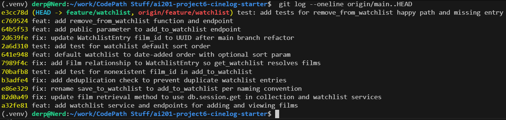

# PR Response Doc — CineLog Watchlist Feature

## AI Usage
I used Claude Code as a pair programmer throughout this project, with the milestones and decisions driven by me. Specifically:

- **Orientation:** Before reading the review comments, I had it summarize `models.py`, `services/collection_service.py`, and `tests/test_collection.py` and confirm the patterns (verb_to_noun naming, the dedup check in `add_to_collection()`, the fixture structure in the tests). It also fetched the six PR comments from the GitHub API so we could read them all before changing anything.
- **Code changes (Comments 1, 2, 3):** It applied the rename, deduplication, and test changes under my direction, following the collection-service patterns we had identified. I verified each against the actual code and test runs rather than trusting the summaries.
- **Design decisions (Comments 4 and 5):** The positions are mine. Claude laid out the tradeoffs of each option (public vs. private default; date-added vs. alphabetical vs. a sort parameter) and I chose: keep `public=True`, and concede the default sort while keeping alphabetical behind a parameter. It then drafted the written arguments from my chosen positions, and I reviewed them. Two things came out of that back-and-forth that I kept: the observation that `CollectionEntry` has no visibility flag at all (so the watchlist is the first list with an opt-out), and the framing that `get_collection()`'s existing newest-first sort is in-codebase evidence for the maintainer's position.
- **Verification:** It wrote small scripts that exercised the dedup path, the sort options, the `public` parameter, and a full UUID round trip through the HTTP API with Flask's test client, in addition to running the pytest suite after every change.
- **Commit hygiene:** It checked the final `git log` against conventional commit format before the history rewrite.

## Comment 1 — Rename
**What I did:** Renamed `save_to_watchlist()` to `add_to_watchlist()` in `services/watchlist_service.py`, and updated both call sites in `routes/watchlist/watchlist.py` (the import on line 8 and the call inside the `add_film` route). I also updated the docstring so it reads "Add a film" instead of "Save a film". The new name follows the project's `verb_to_noun` convention documented in CONTRIBUTING.md and matches its sibling function `add_to_collection()` in the collection service.

**How I verified:** I ran a project-wide search (`grep -rn "save_to_watchlist" --include="*.py" .`) before and after the change. Before the rename it showed exactly three references: the definition and the two call sites in the route file. After the rename the search returns nothing, so no stale references remain. The full test suite passes after the change.

## Comment 2 — Deduplication
**What I did:** I modeled the fix on how `add_to_collection()` in `services/collection_service.py` handles the same problem, at all three layers:

1. **Service:** Added a `WatchlistEntry.query.filter_by(user_id=..., film_id=...).first()` check before the insert. If an entry already exists, `add_to_watchlist()` raises a new `AlreadyInWatchlistError`, mirroring `AlreadyInCollectionError`. The docstring's Raises section now documents it.
2. **Route:** Wrapped the service call in `routes/watchlist/watchlist.py` in try/except so a duplicate returns HTTP 409 and a missing film returns 404, the same status codes `routes/collection.py` uses. Without this, the new exception would have surfaced to API callers as a 500.
3. **Model:** Added a `UniqueConstraint("user_id", "film_id")` to `WatchlistEntry`, matching the `unique_user_film_collection` constraint on `CollectionEntry`. The service check gives a friendly error; the constraint is the database-level backstop against race conditions.

**How I verified:** I ran a script against an in-memory database that added the same film twice: the first call created the entry, the second raised `AlreadyInWatchlistError` with the expected message, and adding a nonexistent film still raised `FilmNotFoundError`. The full test suite passes.

## Comment 3 — Missing test
**What I did:** Created `tests/test_watchlist.py` with `test_add_to_watchlist_nonexistent_film_raises`. I used `test_add_to_collection_nonexistent_film_raises` in `tests/test_collection.py` as the model and copied its structure exactly: the same `app` fixture (isolated app with an in-memory SQLite database), the same `sample_user` and `sample_film` fixtures, and the same assertion style (`pytest.raises(FilmNotFoundError)` with a fake UUID-shaped film id that is guaranteed not to exist).

**How I verified:** `pytest tests/test_watchlist.py -v` passes, and the full suite (`pytest tests/ -v`) passes with 5 tests, confirming the new file did not break the existing collection tests.

## Comment 4 — Default visibility
**My position:** Keep `public=True` as the default for watchlists. This is now an intentional, documented decision rather than an inherited default.

**Reasoning:** CineLog is a community film tracking app, and the watchlist is inherently a social object: "what I want to watch" is exactly the content that powers discovery, recommendations, and the ability to compare lists with friends. Two things drive my choice:

1. **Defaults determine the supply side of a community feature.** Most users never change defaults. If watchlists ship private-by-default, the social layer of CineLog starts and stays mostly empty, and every future discovery feature (browsing a friend's watchlist, "popular on watchlists this week") is starved of data. Opt-in sharing sounds respectful, but in practice it means the community features fail for everyone, including the users who would happily have shared.
2. **A watchlist is intentions, not behavior.** It is meaningfully less sensitive than the collection, which records what a user actually watched and how they rated it. Notably, `CollectionEntry` has no visibility flag at all, so the watchlist is already the more privacy-capable list in the codebase: it is the first list where a user can opt out. Defaulting the flag to `True` matches how comparable platforms treat watchlists while still giving users a control that no other CineLog list currently has.

**Tradeoff acknowledged:** The cost is that a user who never opens their settings exposes their viewing intentions without an explicit choice, and "everyone else does it" is not by itself a privacy argument. Two mitigations: first, the endpoint accepts an explicit `public` parameter (see stretch features), so clients can surface the choice at add-time instead of burying it in settings; second, if CineLog later adds sensitive list types or minors as a user class, this default should be revisited, and this doc is the paper trail for that conversation. If the team decides privacy-by-default is a project-wide value, I would rather flip it now than after launch, since changing a default later silently changes the meaning of existing rows.

## Comment 5 — Sort order
**My position:** Concede the default, keep the capability: `get_watchlist()` now defaults to date-added descending (newest first), and alphabetical remains available as an explicit option (`GET /watchlist/<user_id>?sort=title`, service signature `get_watchlist(user_id, sort="date_added")`). Unknown sort values fall back to the default rather than erroring.

**Reasoning:** A watchlist is a queue of intentions, and the question a returning user asks is "what did I just add?", not "what starts with A?". Recency is the right default for that. There is also a consistency argument from inside this codebase: `get_collection()` already returns newest-first, and two list endpoints in the same API sorting differently by default is a surprise for API consumers. I originally chose alphabetical for scanability, and that use case is real, but it is a lookup behavior ("is Heat already on my list?") that matters most on long lists, so it belongs behind an explicit parameter rather than being the default everyone gets.

**Engagement with reviewer's point:** The maintainer said most users want to see what they added recently, and I think that's right for the default; I'm not just deferring, the collection service's existing behavior is evidence the project already believes this. Where I push back slightly is on treating this as either/or: dropping alphabetical entirely would remove the one ordering that helps users find a specific film on a 200-item watchlist. The `?sort=` parameter keeps the maintainer's preferred behavior as the zero-configuration default while preserving lookup at near-zero maintenance cost (one branch in the service, covered by `test_get_watchlist_returns_newest_first`).

## Comment 6 — Rebase
**What conflicted:** After `git fetch origin` and `git rebase origin/main`, the rebase stopped on my deduplication commit with a content conflict in `models.py`. The two sides of the conflict:

- **main's side:** the UUID refactor changed `Film.id` and `CollectionEntry.film_id` from `Integer` to `String(36)` UUIDs, and main's `models.py` does not contain `WatchlistEntry` at all (the model only exists on this branch).
- **my side:** the `WatchlistEntry` class, which my dedup commit had just modified by adding a `UniqueConstraint`, still declaring `film_id` as `db.Integer`.

Git could not reconcile "this class was deleted/never existed on main" with "this branch modified that class", which is exactly the kind of conflict auto-merge cannot decide for you.

**How I resolved it:** In two steps, textual then semantic:

1. **Textual (during the rebase):** I resolved the `models.py` conflict by keeping main's UUID-based file as the base and re-adding the full `WatchlistEntry` class (with the unique constraint from the commit being replayed), then `git add models.py` and `git rebase --continue`. The remaining commits, including the one adding the `Film.watchlist_entries` relationship, replayed cleanly.
2. **Semantic (follow-up commit):** A textually clean rebase still left the code wrong for UUIDs, so I made a dedicated commit (`fix: update WatchlistEntry film_id to UUID after main branch refactor`) that changed `WatchlistEntry.film_id` from `db.Integer` to `db.String(36)` to match `CollectionEntry.film_id`, and updated the two leftover integer references in docs: the `add_to_watchlist()` docstring ("film_id (int), pre-refactor" became "UUID of the film") and the route docstring body example (`{"film_id": <int>}` became `{"film_id": "<uuid>"}`).

**How I verified no conflict remains:** Four checks. `git status` shows no unmerged paths and the rebase completed with "Successfully rebased". `git log --merges origin/main..HEAD` returns zero merge commits, so the history is linear. The full test suite passes (6 tests), including the watchlist tests which now create films whose ids are real UUIDs. Finally, I exercised the API end to end with Flask's test client: created a film (its id came back as a UUID string), added it to a watchlist via POST (201, film_id echoed as UUID), attempted a duplicate add (409), and fetched the watchlist (200 with the film listed).

## Stretch Features

### Second test: watchlist sort order
`test_get_watchlist_returns_newest_first` in `tests/test_watchlist.py` verifies both that the default order is date-added descending and that `sort="title"` still returns alphabetical order. I chose this case because the sort behavior changed as part of this review cycle (Comment 5), and behavior that just changed in response to review is exactly the behavior most likely to regress; it also pins down the API contract for the new `sort` parameter. It mirrors `test_get_collection_returns_newest_first` with two films added at different times.

### Visibility toggle: explicit `public` parameter
`add_to_watchlist()` now accepts `public=True` as a keyword argument, and `POST /watchlist/<user_id>/add` accepts an optional `"public"` field in the JSON body (`{"film_id": "<uuid>", "public": false}`). Callers can now set visibility explicitly at add-time instead of relying on the default, which is the mitigation referenced in my Comment 4 response: the default stays `True`, but clients can surface the choice to users up front. Verified with the test client: an add with `"public": false` returns the entry with `public: false`, and an add without the field returns `public: true`.

### `remove_from_watchlist()`
Implemented `remove_from_watchlist(user_id, film_id)` in `services/watchlist_service.py`, modeled directly on `remove_from_collection()` in the collection service: same `verb_to_noun` name, same signature shape, same lookup via `filter_by(user_id=..., film_id=...).first()`, and it returns `True` on success. When the film is not on the watchlist it raises a new `NotInWatchlistError`, mirroring `NotInCollectionError`, rather than failing silently or returning a falsy value; the route (`DELETE /watchlist/<user_id>/remove`, body `{"film_id": "<uuid>"}`) translates that to a 404, exactly as `routes/collection.py` does for its remove endpoint. Two tests cover it in `tests/test_watchlist.py`: `test_remove_from_watchlist_deletes_entry` (the entry is actually gone from the database, not just a truthy return) and `test_remove_from_watchlist_not_on_list_raises` (removing a film that was never added raises `NotInWatchlistError`). Also verified over HTTP with the test client: remove returns 200, removing the same film again returns 404.

## Commit History

Final history rewritten with `git rebase -i` (see screenshot below): the original "added watchlist model and endpoint / fixed a bug / more changes" commit was reworded to conventional format, and every commit is one logical change with no merge commits.



## PR Description

### What this feature does
Adds a watchlist to CineLog: films a user wants to watch later, kept separate from the collection of films they have already logged. It exposes three endpoints:

- `GET /watchlist/<user_id>` returns the user's watchlist newest-first, each film annotated with `date_added` and `public`. An optional `?sort=title` switches to alphabetical order.
- `POST /watchlist/<user_id>/add` with body `{"film_id": "<uuid>", "public": false}` (`public` optional) adds a film. It returns `201` with the new entry, `404` if the film does not exist, `409` if the film is already on the watchlist, and `400` if `film_id` is missing.
- `DELETE /watchlist/<user_id>/remove` with body `{"film_id": "<uuid>"}` removes a film. It returns `200` on success and `404` if the film is not on the watchlist.

### Design decisions
1. **Default visibility is `public=True`** (documented in Comment 4 above): watchlists are the social object that powers discovery in a community app, they contain intentions rather than viewing history, and callers can opt out explicitly via the `public` parameter at add-time.
2. **Default sort is date-added, newest first** (documented in Comment 5 above): it matches what returning users ask of a queue, and it is consistent with `get_collection()`. Alphabetical order is preserved behind `?sort=title` for finding a specific film on a long list.

### How to manually test
1. Setup: `python -m venv .venv && source .venv/bin/activate && pip install -r requirements.txt`
2. Seed a user and a film (the films API is read-only), from the repo root:
   ```bash
   python -c "
   from app import create_app, db
   from models import User, Film
   app = create_app()
   with app.app_context():
       u = User(username='demo', email='demo@example.com')
       f = Film(title='Paddington 2', year=2017, genre='Comedy')
       db.session.add_all([u, f]); db.session.commit()
       print('USER_ID=' + u.id); print('FILM_ID=' + f.id)
   "
   ```
3. Start the app: `python app.py` (serves on http://127.0.0.1:5000).
4. Add the film to the watchlist (expect `201` and `"public": true`):
   ```bash
   curl -s -X POST http://127.0.0.1:5000/watchlist/<USER_ID>/add \
     -H "Content-Type: application/json" -d '{"film_id": "<FILM_ID>"}'
   ```
5. Add it again (expect `409` with an "already on this user's watchlist" error).
6. Add with a bogus film id (expect `404`): same command with `"film_id": "does-not-exist"`.
7. View the watchlist (expect the film, newest first): `curl -s http://127.0.0.1:5000/watchlist/<USER_ID>`; then `curl -s "http://127.0.0.1:5000/watchlist/<USER_ID>?sort=title"` for alphabetical.
8. Add another film with `"public": false` in the body and confirm the entry comes back with `"public": false`.
9. Remove the first film (expect `200`), then remove it again (expect `404`):
   ```bash
   curl -s -X DELETE http://127.0.0.1:5000/watchlist/<USER_ID>/remove \
     -H "Content-Type: application/json" -d '{"film_id": "<FILM_ID>"}'
   ```
10. Run the suite: `pytest tests/ -v` (8 tests, all passing).
